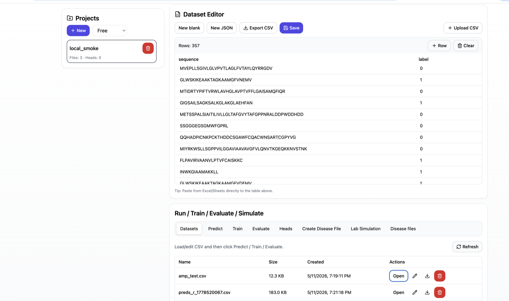
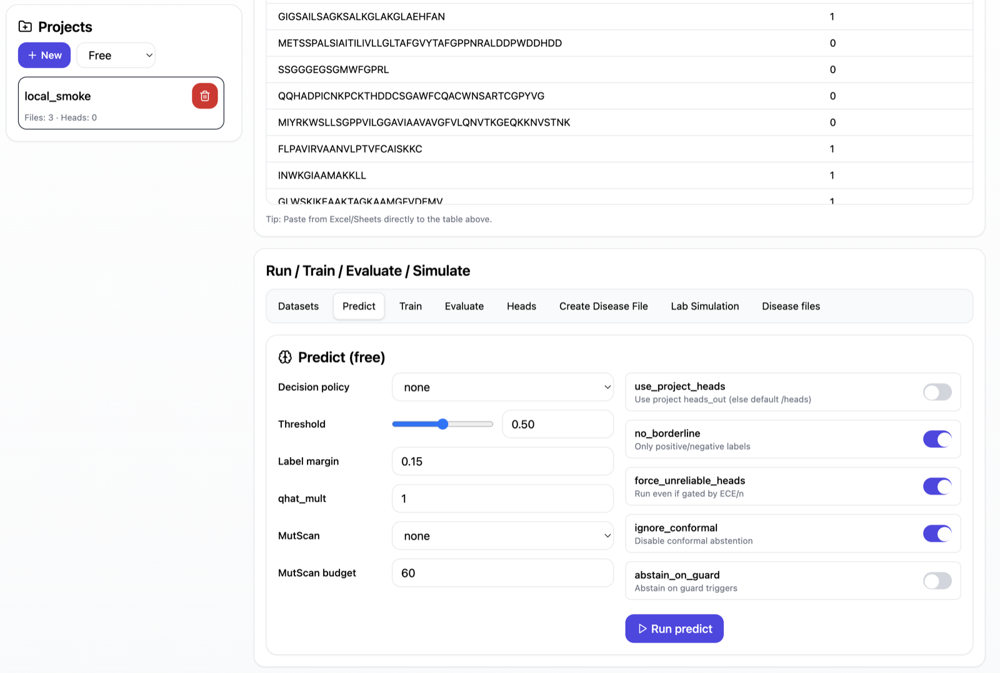
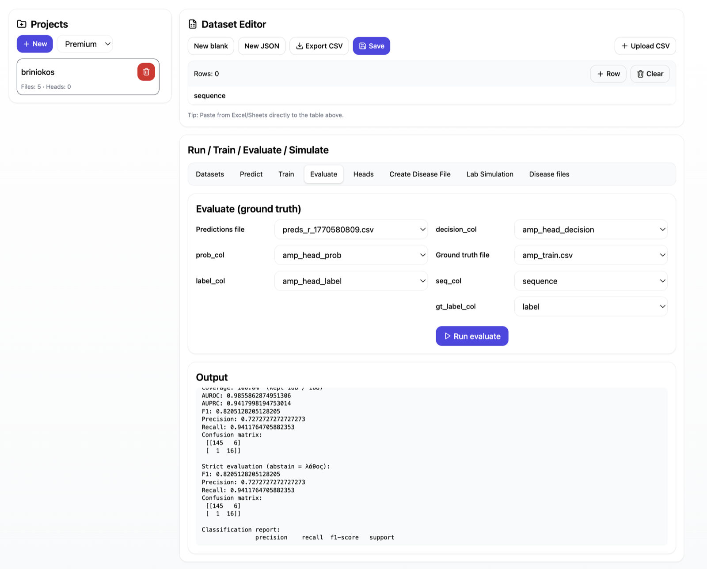
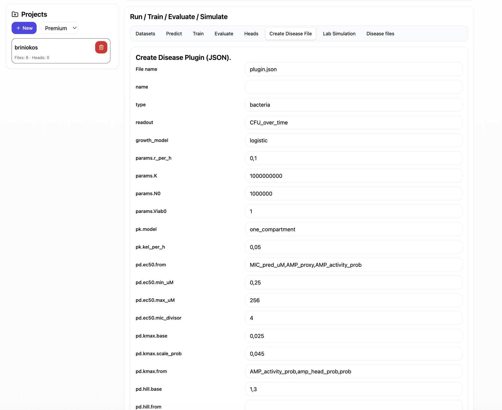
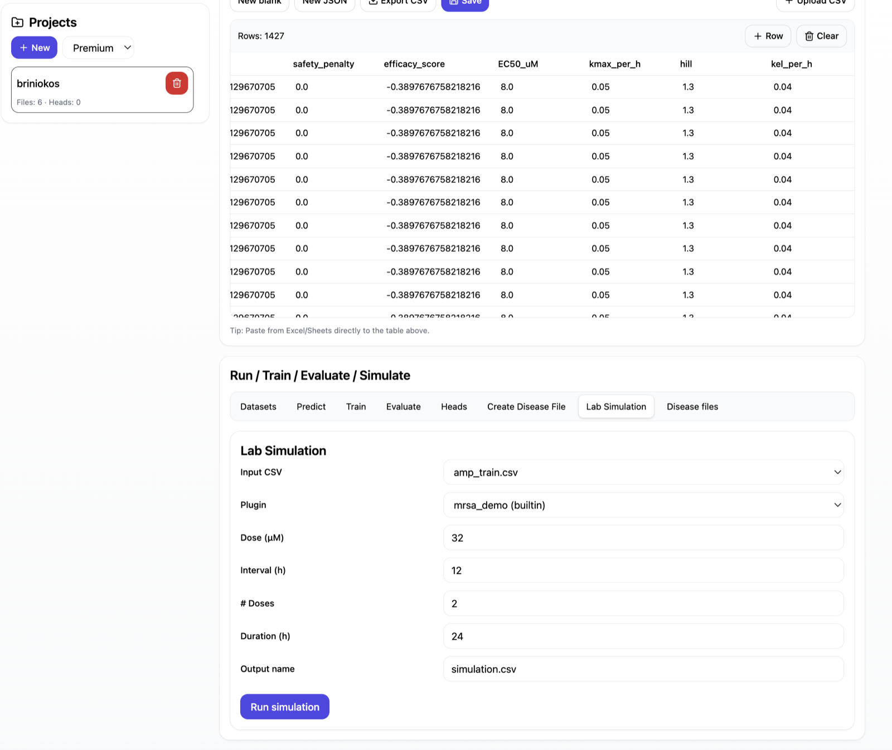

# Evotensor

Evotensor is a research-only protein and peptide modeling project built around
compact tensor-network sequence representations, specialist downstream heads, a
FastAPI backend, and a Vite/React UI.

The main design goal is a compact, CPU-runnable peptide modeling workflow. The
training architecture uses multiscale tensor-network specialists and
biological/symbolic sequence features; the final local product runs inference,
evaluation, and simulation without requiring GPU inference.

The repository is prepared so a user can run the app locally, inspect the model
artifacts, run inference, evaluate predictions against ground truth, and run a
small disease-plugin simulation.

Status: research demo  
License: Evotensor Research Non-Commercial License

For the scientific rationale, architecture, evaluation framing, and limitations,
read [about.md](about.md).

## Why This Project Matters

- CPU-runnable local inference: the included app and model artifacts can run on
  a normal laptop or small server after setup.
- Compact model footprint: specialist artifacts are small enough to inspect,
  ship, and run without transformer-scale infrastructure.
- Multiscale training architecture: the model uses tensor-network specialists,
  symbolic integration, and downstream heads instead of relying only on a large
  generic embedding model.
- End-to-end workflow: upload sequences, predict, evaluate against ground truth,
  and run disease-plugin simulation from the same local app.
- Reproducible held-out AMP result: the committed AMP test split excludes
  peptides used to train the default AMP head and reaches AUROC 0.9555 / F1
  0.9122 with the included predictions.

## Screenshots

### Dataset workspace



### Prediction workflow



### Evaluation metrics



### Disease plugin builder



### Lab simulation



## What Is Included

- `frontend/evotensor-pro-ui` - Vite/React web UI
- `backend/main.py` - FastAPI backend adapted from the live server
- `pep_product.py` - local inference and specialist-head prediction CLI
- `groundtruth.py` - coverage-aware evaluation CLI
- `labsim_demo.py` - lightweight disease-plugin PK/PD simulator
- `heads/` - small downstream demo heads
- `specialists/` - tensor-network specialist model artifacts
- `datasets/` - train/test/demo CSV assets and committed prediction outputs
- `demo/evaluation/` - ready-to-run AMP prediction vs ground-truth evaluation
- `demo/ecoli_uti/` - E.coli UTI disease-plugin simulation demo
- `docs/screenshots/` - README interface screenshots
- `training/` - original training pipeline scripts
- `Eval-results/` - saved evaluation artifacts
- `DATA_PROVENANCE.md` - source and licensing notes for training/demo data

Runtime folders such as `volumes/`, `.venv/`, `node_modules/`, build output,
and local secret files are excluded through `.gitignore`.

## Local Setup

Use Python 3.11, 3.12, or 3.13 locally. Python 3.12 is the preferred version
for the original pinned scientific stack, while Python 3.13 uses a newer
compatible wheel stack selected automatically from `backend/requirements.txt`.

```bash
bash scripts/setup_local.sh
```

On macOS/Homebrew, `scripts/setup_local.sh` automatically exports the Homebrew
`expat` library path when `/opt/homebrew/opt/expat/lib` exists.

Verify the clone before running the app:

```bash
bash scripts/smoke_test.sh
```

The smoke test compiles the backend scripts, imports the Python scientific
stack, builds the frontend, runs AMP evaluation, runs the E.coli simulation
demo, and runs a prediction demo.

## Run The App

Terminal 1:

```bash
bash scripts/run_backend.sh
```

Terminal 2:

```bash
bash scripts/run_frontend.sh
```

Open:

```text
http://127.0.0.1:5173
```

The local scripts default to development auth:

```text
EVOTENSOR_AUTH_MODE=dev
VITE_AUTH_MODE=dev
```

For production/Firebase mode, copy `.env.example`, provide `FIREBASE_CRED`, and
set the frontend Firebase environment variables.

## Web Interface Usage

The web interface is the primary way to use Evotensor locally. Start the backend
and frontend, then open:

```text
http://127.0.0.1:5173
```

Local development mode uses dev auth, so any local login flow is only for local
testing. Production/Firebase auth requires proper environment configuration.

### 1. Create or select a project

On first local run, the backend seeds an `Evotensor Demo` project automatically.
It includes:

- `amp_predictions.csv`
- `amp_ground_truth.csv`
- `for_ecoli_lab_test.csv`
- `ecoli_disease_plugin.json`
- `ecoli_lab_sim.csv`

Use the left project panel:

1. Click `New`.
2. Select a tier (`Free` or `Premium`) for the project.
3. Click the project card to work inside it.

Project files, prediction outputs, trained project heads, disease plugins, and
simulation outputs are stored under that project in local `volumes/`.

### 2. Upload or edit a dataset

Use the `Datasets` tab.

Accepted input for prediction:

```csv
sequence
GLWSKIKEAAKTAGKAAMGFVNEMV
GIGKFLKKAKKFGKAFVKILKK
```

Accepted input for training/evaluation:

```csv
sequence,label
GLWSKIKEAAKTAGKAAMGFVNEMV,1
MVEPLLSGIVLGLVPVTLAGLFVTAYLQYRRGDV,0
```

Actions:

- `Upload CSV` imports an existing CSV.
- `New blank` creates an editable table.
- `New JSON` is useful for plugin-style files.
- `Save` writes the current editor content into the selected project.
- `Export CSV` downloads the visible table.

### 3. Run prediction

Use the `Predict` tab.

1. Upload or open a CSV with a `sequence` column.
2. Open `Predict`.
3. Choose prediction settings:
   - `Decision policy`: usually `none` for simple positive/negative output.
   - `Threshold`: default `0.50`.
   - `use_project_heads`: off uses default heads from `heads/`; on uses heads
     trained inside the current project.
   - `no_borderline`: returns positive/negative labels without borderline.
   - `force_unreliable_heads`: allows demo heads even if reliability gates would
     normally block them.
   - `ignore_conformal`: disables conformal abstention for simple demos.
   - `MutScan`: keep `none` unless testing mutation scanning.
4. Click `Run predict`.

The backend creates a new predictions CSV in the project file list. Open it from
the `Datasets` tab to inspect columns such as:

- `amp_head_prob`, `amp_head_label`, `amp_head_decision`
- `is_toxin_head_prob`, `is_toxin_head_label`, `is_toxin_head_decision`
- `pseudo_cpp_head_prob`, `pseudo_cpp_head_label`, `pseudo_cpp_head_decision`
- `pseudo_mic_head_pred`
- `pseudo_stability_head_prob`, `pseudo_stability_head_label`

### 4. Evaluate predictions

Use the `Evaluate` tab.

You need:

- a predictions CSV produced by `Run predict`;
- a ground-truth CSV with matching `sequence` values and a label column.

Steps:

1. Select `Predictions file`.
2. Select columns:
   - `prob_col`, for example `amp_head_prob`;
   - `label_col`, for example `amp_head_label`;
   - `decision_col`, for example `amp_head_decision`.
3. Select `Ground truth file`.
4. Select:
   - `seq_col`: usually `sequence`;
   - `gt_label_col`: usually `label`.
5. Click `Run evaluate`.

The output panel prints coverage-aware metrics:

- AUROC
- AUPRC
- F1
- precision
- recall
- confusion matrix
- strict evaluation where abstain counts as wrong
- classification report

For the included demo, upload/select `demo/evaluation/amp_predictions.csv` and
`demo/evaluation/amp_ground_truth.csv`, or use the already included project
files if you generated them locally.

### 5. Train a project head

Use the `Train` tab.

Training a head creates a project-local model under that project's `heads_out`
folder. This is separate from the default repository heads in `heads/`.

For classification heads, prepare:

```csv
sequence,label
PEPTIDESEQAAA,1
PEPTIDESEQBBB,0
```

Steps:

1. Upload the labeled CSV.
2. Open `Train`.
3. Set `Type` to `classification`.
4. Set `Task name`, for example `my_amp_head`.
5. Select the dataset file.
6. Set `seq_col` to `sequence`.
7. Set `label_col` to `label`.
8. Keep `feat_mode` as `fuse` for the normal combined feature mode.
9. Keep `calibration` as `sigmoid` unless testing alternatives.
10. Set `cv_folds`, usually `5`.
11. Click `Train head`.

For regression heads, use a numeric target column:

```csv
sequence,MIC_uM
PEPTIDESEQAAA,12.5
PEPTIDESEQBBB,64.0
```

Then set `Type` to `regression` and set the target column, for example
`MIC_uM`.

After training, open the `Heads` tab to inspect project heads. To use them in
prediction, enable `use_project_heads` in the `Predict` tab.

### 6. Create a disease plugin

Use the `Create Disease File` tab.

This builds a JSON disease/plugin configuration for `labsim_demo.py`. The common
bacteria plugin fields are:

- `name`: human-readable plugin name.
- `type`: usually `bacteria`.
- `readout`: for example `CFU_over_time`.
- `growth_model`: usually `logistic`.
- `params.r_per_h`, `params.K`, `params.N0`: growth parameters.
- `pk.model`, `pk.kel_per_h`: simple PK model settings.
- `pd.ec50.*`, `pd.kmax.*`, `pd.hill.*`: pharmacodynamic mapping from
  prediction columns to simulation behavior.
- `safety.tox_from`: toxicity probability columns used as safety penalty inputs.
- `endpoint_hours`: simulation endpoint.

Steps:

1. Open `Create Disease File`.
2. Fill or edit the fields.
3. Set `File name`, for example `ecoli_disease_plugin.json`.
4. Save the plugin into the project.

The included example is:

```text
demo/ecoli_uti/ecoli_disease_plugin.json
```

### 7. Run lab simulation

Use the `Lab Simulation` tab.

You need:

- an input CSV with peptide predictions or peptide features;
- a plugin, either built-in or saved as a project JSON file.

Steps:

1. Select `Input CSV`.
2. Select `Plugin`:
   - built-in options include demo plugins such as `mrsa_demo`;
   - project plugin files can be selected after saving/uploading them.
3. Set dosing parameters:
   - `Dose (uM)`;
   - `Interval (h)`;
   - `# Doses`;
   - `Duration (h)`.
4. Set `Output name`, for example `simulation.csv`.
5. Click `Run simulation`.

The output CSV is added to the current project. Typical output columns include:

- `sequence`
- `Endpoint_h`
- `kill_log10`
- `CFU_end`
- `safety_penalty`
- `efficacy_score`
- `EC50_uM`
- `kmax_per_h`
- `hill`
- `kel_per_h`

### 8. Manage disease files and outputs

Use `Disease files` to inspect saved disease/plugin files. Use `Datasets` to
open prediction outputs, training datasets, simulation outputs, and evaluation
inputs.

The project file list also supports opening, renaming, downloading, and deleting
project files.

## CLI Workflows

The CLI scripts expose the same core operations used by the web backend.

Run inference on a CSV containing a `sequence` column:

```bash
python pep_product.py predict \
  --input_csv datasets/amp_test.csv \
  --seq_col sequence \
  --out_csv /tmp/evotensor_amp_predictions.csv \
  --heads_dir heads \
  --force_unreliable_heads \
  --ignore_conformal \
  --no_borderline \
  --mutscan none
```

Train a classification head:

```bash
python pep_product.py train \
  --task_name my_amp_head \
  --dataset_csv datasets/amp_train.csv \
  --seq_col sequence \
  --label_col label \
  --feat_mode fuse \
  --calibration sigmoid \
  --heads_dir /tmp/evotensor_heads_out \
  --cv_folds 5
```

Train a regression head:

```bash
python pep_product.py train_reg \
  --task_name my_mic_head \
  --dataset_csv datasets/mic_train.csv \
  --seq_col sequence \
  --target_col MIC_uM \
  --feat_mode fuse \
  --heads_dir /tmp/evotensor_heads_out \
  --cv_folds 5
```

Evaluate predictions against a `sequence,label` ground-truth CSV:

```bash
python groundtruth.py \
  --pred_csv demo/evaluation/amp_predictions.csv \
  --gt_csv demo/evaluation/amp_ground_truth.csv
```

Run the E.coli UTI disease-plugin simulation:

```bash
python labsim_demo.py \
  --peptides_csv demo/ecoli_uti/for_ecoli_lab_test.csv \
  --plugin demo/ecoli_uti/ecoli_disease_plugin.json \
  --out_csv /tmp/evotensor_ecoli_lab_sim.csv
```

## Local Verification Results

The following checks were run locally on May 14, 2026 with the committed demo
assets.

### Reproducible Test-Set Evaluation

These metrics are computed from committed prediction CSVs and matching committed
held-out test labels using `groundtruth.py`. The AMP evaluation file
`datasets/amp_test.csv` contains peptides that were excluded from training the
default AMP head.

Evidence level differs by head. The AMP head is the cleanest held-out demo in
this repository. Some heads, including toxicity and CPP, were trained with
synthetic or pseudo-labeled data and should be treated as functional demos until
validated on independent real datasets.

| Task | Prediction CSV | Ground Truth | n | AUROC | AUPRC | F1 | Accuracy |
| --- | --- | --- | ---: | ---: | ---: | ---: | ---: |
| AMP activity | `datasets/outputs/amp.csv` | `datasets/amp_test.csv` held-out | 357 | 0.9555 | 0.9574 | 0.9122 | 0.913 |
| Toxicity synthetic/pseudo | `datasets/outputs/toxin.csv` | `datasets/tox_test.csv` | 468 | 0.9528 | 0.9410 | 0.8951 | 0.895 |
| Stability | `datasets/outputs/stability.csv` | `datasets/stability_test.csv` | 601 | 0.8333 | 0.7834 | 0.7655 | 0.760 |
| CPP synthetic/pseudo demo | `datasets/outputs/cpp.csv` | `datasets/cpp_test.csv` | 19 | 1.0000 | 1.0000 | 1.0000 | 1.000 |

The toxicity and CPP results are synthetic/pseudo-data checks. The CPP result is
also a very small demo-set check (`n=19`), not a broad validation claim.

### Head Cross-Validation Summaries

These values come from the saved `heads/*.summary.json` artifacts.

| Head | Type | n | AUROC / R2 | AUPRC / MAE |
| --- | --- | ---: | ---: | ---: |
| `amp_head` | classification | 1427 | AUROC 0.9437 | AUPRC 0.9450 |
| `is_toxin_head` synthetic/pseudo | classification | 1868 | AUROC 0.9470 | AUPRC 0.9367 |
| `pseudo_stability_head` | classification | 2401 | AUROC 0.8247 | AUPRC 0.7848 |
| `pseudo_cpp_head` | classification | 75 | AUROC 0.9920 | AUPRC 0.9886 |
| `pseudo_mic_head` | regression | 2504 | R2 0.7009 | MAE 32.2586 |

### Additional Checks

- `npm run build` in `frontend/evotensor-pro-ui` passed.
- `pep_product.py predict` passed on a 20-sequence AMP smoke subset and loaded
  all 3 specialists.
- `labsim_demo.py` passed on the E.coli UTI demo and reproduced the expected
  ranking in `demo/ecoli_uti/simulation_2.csv`.
- The local backend `/api/evaluate` endpoint returned metrics successfully from
  uploaded prediction and ground-truth files.

## Scientific Model Summary

Evotensor uses a compact sequence representation inspired by tensor-network
methods:

- Matrix Product State style local sequence encoding
- MERA-like hierarchical coarse-graining for longer-range structure
- projected multiscale sequence vectors
- specialist heads for AMP, toxicity, stability, CPP, MIC-like prediction, and
  downstream simulations

The final inference path is intentionally lightweight. The included specialist
artifacts and heads can be loaded and run on CPU, which makes the system suitable
for local research workflows, small deployments, and reproducible demos without
GPU serving infrastructure.

The conceptual physics analogy is useful as an inductive-bias description, but
the repository should be read as a computational biology research prototype, not
as a clinical or diagnostic system.

## Training Pipeline

The original training scripts are preserved in `training/`:

```bash
python training/symbolics_integration.py
python training/train_with_symbolics.py
python training/range_finetune_master.py
python training/multi-specialist-fine-tuning.py
```

The demonstration and specialist artifacts were trained from peptide/protein
sequence resources including UniProt and Pfam-A.seed derived data. Make sure any
redistribution or reuse follows the relevant upstream data licenses.

See [DATA_PROVENANCE.md](DATA_PROVENANCE.md) for source notes. In short:

- historical base/master/specialist training used UniProt and Pfam-derived
  sequence resources;
- Pfam/InterPro downloadable data is documented as CC0 1.0;
- UniProt RDF metadata reports CC BY 4.0;
- AMP uses project-curated train/test CSVs, with `datasets/amp_test.csv`
  excluded from default AMP-head training;
- toxicity and CPP heads are synthetic/pseudo-labeled demos, not real-world
  validation datasets.

## Limitations

- Research-only demo, not medical advice and not clinical validation.
- Some demo heads are trained on small or synthetic/pseudo-labeled datasets,
  including the toxicity and CPP demo heads.
- Upstream data sources have their own terms. This repository's license does not
  relicense UniProt, Pfam, or any other third-party source data.
- Reported metrics use held-out demo test splits, including AMP peptides excluded
  from default-head training, but should still be replicated on independent
  external datasets before making stronger claims.
- Model artifacts are small enough for normal GitHub hosting, but Git LFS is
  recommended for future larger weights.

## License

This project is released under the [Evotensor Research Non-Commercial License](LICENSE).

Allowed:

- academic and non-commercial scientific research
- personal learning and experimentation
- educational demonstrations
- non-commercial modification and redistribution under the same license

Not allowed without prior written permission:

- commercial products, SaaS, APIs, consulting deliverables, or paid services
- commercial biotech, pharma, diagnostics, therapeutic, chemical, agricultural,
  or materials discovery use
- using the code, model artifacts, heads, predictions, or derivatives to train,
  improve, benchmark, validate, or monetize another commercial system
- repackaging, hosting, selling, sublicensing, or integrating the work into a
  proprietary commercial workflow

## Citation

Brinias, K. (2025). Evotensor: A Multiscale Tensor-Network System for Protein
Sequence Modeling. Research software.
